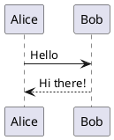

# Vomit

*[Claude Code](https://claude.com/claude-code) crushes React. This app is fully vibe-coded.*

An opinionated, keyboard-centric markdown editor for presentations and notes with **local AI support** (privacy first). Your data never leaves your machine.


## Why Vomit?

| Feature | PowerPoint | Obsidian | Marp | Vomit |
|---------|:----------:|:--------:|:----:|:-----:|
| Markdown native | ❌ | ✅ | ✅ | ✅ |
| Live preview | ✅ | ✅ | ✅ | ✅ |
| Presenter view with notes | ✅ | ❌ | ✅ | ✅ |
| Timer | ✅ | ❌ | ✅ | ✅ |
| Next slide preview | ✅ | ❌ | ✅ | ✅ |
| Standalone app | ✅ | ✅ | ❌ | ✅ |
| PlantUML diagrams | ❌ | Plugin | ✅ | ✅ |
| LaTeX math | ❌ | Plugin | ✅ | ✅ |
| Code syntax highlighting | ❌ | ✅ | ✅ | ✅ |
| **Local AI (privacy first)** | ❌ | Plugin | ❌ | ✅ |
| **RAG over your docs** | ❌ | Plugin | ❌ | ✅ |
| **Pseudonymization** | ❌ | ❌ | ❌ | ✅ |

## Features

- **Markdown Editor** - Live preview, syntax highlighting, outline sidebar
- **Presenter View** - Current slide, next slide preview, speaker notes, timer
- **Local AI (Privacy First)** - Built-in AI terminal powered by Ollama - your data stays on your machine
- **RAG Search** - Index your documents and ask AI questions with context from your files
- **Pseudonymization** - Anonymize sensitive data (names, emails, IPs) with AI, reversible with `/depseudo`
- **LaTeX Math** - Render formulas with KaTeX (`$inline$` and `$$display$$`)
- **PlantUML Diagrams** - Render sequence diagrams, flowcharts, and more
- **Emoji Shortcodes** - Use `:smile:` syntax like GitHub/Slack
- **File Tree** - Browse and open files in current directory (Cmd+Shift+E)
- **Search in Files** - Search across all markdown files (Cmd+Shift+F)
- **Laser Pointer** - Press L during presentation to highlight
- **PDF Export** - Export slides to PDF for sharing
- **Image Support** - Paste images directly, resize with simple syntax
- **Themes** - Default, Dark, Catppuccin, Nord, Solarized Dark
- **Keyboard Shortcuts** - Full keyboard control for everything

## Installation

### Option 1: Download DMG

Download the latest `.dmg` from [Releases](https://github.com/jacqinthebox/vomit-vnext/releases), open it, and drag to Applications.

**Important:** The app is not code-signed with an Apple Developer certificate. macOS will block it by default. After installing, run this command in Terminal to remove the quarantine flag:

```bash
xattr -cr /Applications/Vomit\ vNext.app
```

Then the app will open normally.

### CLI Launcher

To open files or folders from the terminal, create a symlink:

```bash
mkdir -p ~/.local/bin
ln -s /Applications/Vomit.app/Contents/Resources/app/bin/vomit ~/.local/bin/vomit
```

Make sure `~/.local/bin` is in your PATH (add to `~/.zshrc` if needed):

```bash
export PATH="$HOME/.local/bin:$PATH"
```

Then use:

```bash
vomit .                  # Open current directory
vomit ~/notes            # Open a folder
vomit presentation.md    # Open a file
```

### Option 2: Build from Source

```bash
# Clone the repository
git clone https://github.com/jacqinthebox/vomit-vnext.git
cd vomit-vnext

# Install dependencies
npm install

# Run the app
npm start

# Or build a DMG
npm run build
```

## Usage

### Slide Format

Separate slides with `---` on its own line:

```markdown
# First Slide

Your content here

---

# Second Slide

More content
```

### Speaker Notes

Add notes after `???` - only visible in presenter view:

```markdown
# Slide Title

Content for the audience

???

Notes only you can see while presenting
```

### Images

Paste images directly with Cmd+V. They are saved to an `images/` folder next to your file.

Resize images with this syntax:

```markdown
      # width 400px
      # height 300px
   # both
```

### PlantUML Diagrams

Create diagrams using PlantUML syntax in fenced code blocks:

~~~markdown

```plantuml
@startuml
Alice -> Bob: Hello
Bob --> Alice: Hi there!
@enduml
```
~~~

Diagrams are rendered via the PlantUML server. Supports sequence diagrams, class diagrams, flowcharts, and more. See [PlantUML documentation](https://plantuml.com/) for syntax.

### Emoji Shortcodes

Use GitHub/Slack-style emoji shortcodes:

```markdown
:smile: :rocket: :fire: :heart: :thumbsup: :vomit:
```

Renders as: :smile: :rocket: :fire: :heart: :thumbsup: :vomit:

Over 200 shortcodes are supported including smileys, gestures, objects, animals, food, and more.

### Ollama AI Integration (Privacy First)

Vomit includes a built-in AI terminal powered by [Ollama](https://ollama.ai). All AI processing happens locally - your data never leaves your machine.

**Setup:**
1. Install Ollama from https://ollama.ai
2. Pull a model: `ollama pull qwen2.5:14b` (recommended for best results)
3. Open a folder in Vomit (Cmd+Alt+O)
4. Press `Cmd+J` or select a model from the AI menu

**Special commands:**
- `/doc <prompt>` - Include the current document in your prompt
- `/pseudo` - Pseudonymize the current document (names, emails, IPs, secrets)
- `/depseudo` - Restore original data from pseudonymized file using the mapping
- `/index` - Index all documents in the folder for RAG search
- `/index subfolder` - Index only a specific subfolder
- `/rag <query>` - Search indexed documents and ask AI with context

**RAG (Retrieval Augmented Generation):**

RAG allows the AI to answer questions using all your project documents as context. First index your folder with `/index`, then use `/rag <question>` to query with relevant context automatically retrieved.

```bash
# First, pull the embedding model
ollama pull nomic-embed-text

# In Vomit AI terminal
/index                              # Index entire project
/index src/docs                     # Index only a subfolder
/rag how does authentication work?  # Search and ask with context
```

The index is stored in `~/.config/vomit/rag/` to keep your project clean.

The AI menu shows all your installed Ollama models - just click one to switch.

## Keyboard Shortcuts

Press **Cmd+/** to view all shortcuts in the app. See [SHORTCUTS.md](SHORTCUTS.md) for the complete reference.

### Quick Reference

| Category | Shortcut | Action |
|----------|----------|--------|
| **File** | Cmd+N | New file |
| | Cmd+O | Open file |
| | Cmd+S | Save |
| **View** | Cmd+P | Toggle preview |
| | Cmd+E | Toggle file explorer |
| | Cmd+L | Toggle line numbers |
| | Cmd+/ | Show all shortcuts |
| **Format** | Cmd+B | Bold |
| | Cmd+I | Italic |
| | Cmd+K | Insert link |
| | Cmd+T | Insert table |
| **Code** | Ctrl+J | Autocomplete |
| **Explorer** | ↑↓ | Navigate files |
| | ←→ | Navigate folders |
| | Ctrl+Tab | Switch to editor |
| **Present** | Cmd+Shift+P | Start presentation |
| | Cmd+Alt+P | With presenter view |
| | L | Laser pointer |
| **AI** | Cmd+J | Toggle AI terminal |

## Tech Stack

- Electron
- CodeMirror 5 (editor with syntax highlighting)
- Marked (markdown parsing)
- Highlight.js (code block highlighting)
- KaTeX (LaTeX math rendering)
- PlantUML (diagram rendering)
- Ollama (local AI inference)
- better-sqlite3 (RAG vector storage)

## License

MIT
