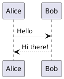

# Vomit

_[Claude Code](https://claude.com/claude-code) crushes React. This app is fully vibe-coded._

An opinionated, keyboard-centric markdown editor for presentations and notes with **local AI support** (privacy first). Your data never leaves your machine.


## Why Vomit?

| Feature                      | PowerPoint | Obsidian | Marp | Vomit |
| ---------------------------- | :--------: | :------: | :--: | :---: |
| Markdown native              |     ❌     |    ✅    |  ✅  |  ✅   |
| Live preview                 |     ✅     |    ✅    |  ✅  |  ✅   |
| Presenter view with notes    |     ✅     |    ❌    |  ✅  |  ✅   |
| Timer                        |     ✅     |    ❌    |  ✅  |  ✅   |
| Next slide preview           |     ✅     |    ❌    |  ✅  |  ✅   |
| Standalone app               |     ✅     |    ✅    |  ❌  |  ✅   |
| PlantUML diagrams            |     ❌     |  Plugin  |  ✅  |  ✅   |
| LaTeX math                   |     ❌     |  Plugin  |  ✅  |  ✅   |
| Code syntax highlighting     |     ❌     |    ✅    |  ✅  |  ✅   |
| **Local AI (privacy first)** |     ❌     |  Plugin  |  ❌  |  ✅   |
| **RAG over your docs**       |     ❌     |  Plugin  |  ❌  |  ✅   |
| **Pseudonymization**         |     ❌     |    ❌    |  ❌  |  ✅   |

## Platform Support

**macOS** (Intel and Apple Silicon), **Windows** (x64 and arm64), and **Linux** (Ubuntu 24.04+, x64 and arm64). All three are packaged by CI.

Keyboard shortcuts shown as **Cmd** on macOS use **Ctrl** on Windows/Linux. **Option** maps to **Alt**.

## Features

- **Markdown Editor** - Live preview, syntax highlighting (including Terraform/HCL and PowerShell in code fences like ` ```terraform `, ` ```tfvars `, ` ```powershell `, and in `.tf`/`.tfvars`/`.ps1` files), outline sidebar
- **Right Outline Bar** - Always-visible document outline on the right (Cmd+Alt+O)
- **Multi-Cursor Editing** - PyCharm-style multi-cursor: double-tap Option, then use Option+Up/Down
- **Drag & Drop** - Drag files and folders to reorganize your file tree
- **Git Awareness** - Change indicators in the editor gutter and status badges in the file tree when the folder is a git repo
- **Presenter View** - Current slide, next slide preview, speaker notes, timer
- **Local AI (Privacy First)** - Built-in AI terminal powered by Ollama - your data stays on your machine
- **RAG Search** - Index a bucket and ask AI questions with context from that bucket
- **Markdown Todos** - Track `- [ ]` tasks in notes with a bucket-wide Todo Explorer
- **Pseudonymization** - Anonymize sensitive data (names, emails, IPs) with a fast offline scan or AI, reversible with `/pseudo-restore`
- **LaTeX Math** - Render formulas with KaTeX (`$inline$` and `$$display$$`)
- **PlantUML & Mermaid** - Render sequence diagrams, flowcharts, and more
- **Emoji Shortcodes** - Use `:smile:` syntax like GitHub/Slack
- **File Tree** - Browse and open files in your bucket (Cmd+E)
- **Native Viewers** - Open PDF, draw.io, and image files directly inside Vomit
- **Tag & Todo Explorers** - Browse tags and open todos across the current bucket
- **Search in Files** - Search across all markdown files (Cmd+Shift+F)
- **Laser Pointer** - Press L during presentation to highlight
- **PDF Export** - Export slides to PDF for sharing
- **Image Support** - Paste images directly, resize with simple syntax
- **Themes** - Default, Dark, Catppuccin, Nord, Tokyo Night, Solarized Dark
- **Keyboard Shortcuts** - Full keyboard control for everything

## Buckets

Vomit uses "buckets" - dedicated folders to store your notes and presentations. On first launch, you'll be asked to choose a location (default: `~/Documents/Vomit`).

- **Multiple buckets** - Add as many project folders as you need via the Buckets menu
- **Quick switching** - Switch between buckets with a single click
- New markdown files are automatically created with frontmatter metadata: title, folder, created date, modified date, draft status, and tags
- Images are saved to `bucket/images/`
- No need to manually open folders - just select a bucket and write

Manage buckets from the **Buckets** menu: add new buckets, switch between them, or remove any bucket via the **Remove Bucket** submenu. Removing a bucket never deletes your files — it only removes the entry from Vomit. If a bucket's folder has been moved or deleted, selecting it offers to remove the stale entry.

## Todos

Todos are markdown-native. Your notes remain the source of truth; Vomit scans the current bucket and shows matching checkbox items in the Todo Explorer.

```markdown
- [ ] Send migration plan to Acme #follow-up @2026-06-01 !high
- [ ] Check Kubernetes ingress config #tech
- [x] Confirm project owner
```

- Use **Cmd+Shift+Enter** to toggle the current line or selected lines between todo states
- Use **View > Toggle Todos** or the command palette to open the Todo Explorer
- Click a todo in the explorer to open the note at that line
- Optional tokens are parsed as badges: `@YYYY-MM-DD` for due date, `!high`/`!medium`/`!low` for priority, and `#tag` for tags
- Todo Explorer reads saved markdown files in the current bucket; save or wait for auto-save after editing todos

## Installation

### Option 1: Download a Release

Download the latest macOS `.dmg`, Windows `.exe`, or Linux `.AppImage`/`.deb` from [Releases](https://github.com/jacqinthebox/vomit-vnext/releases).

**Important:** The app is not code-signed with an Apple Developer certificate. macOS will block it by default. After installing, run this command in Terminal to remove the quarantine flag:

```bash
xattr -cr /Applications/Vomit.app
```

Then the app will open normally.

### Option 2: Build from Source

```bash
# Clone the repository
git clone https://github.com/jacqinthebox/vomit-vnext.git
cd vomit-vnext

# Install dependencies
npm install

# Run the app
npm start

# Or build a platform package
npm run build:mac   # macOS
npm run build:win   # Windows
npm run build:linux # Linux (AppImage + deb)
```

## Usage

### Slide Format

Separate slides with `---` on its own line:

```markdown
# First Slide

Your content here

---

# Second Slide

More content
```

### Speaker Notes

Add notes after `???` - only visible in presenter view:

```markdown
# Slide Title

Content for the audience

???

Notes only you can see while presenting
```

### Images

Paste images directly with Cmd+V. They are saved to an `images/` folder next to your file.

Resize images with this syntax:

```markdown
 # width 400px
 # height 300px
 # both
```

### PlantUML Diagrams

Create diagrams using PlantUML syntax in fenced code blocks:

````markdown

```plantuml
@startuml
Alice -> Bob: Hello
Bob --> Alice: Hi there!
@enduml
```
````

Diagrams are rendered via the PlantUML server. Supports sequence diagrams, class diagrams, flowcharts, and more. See [PlantUML documentation](https://plantuml.com/) for syntax.

### Emoji Shortcodes

Use GitHub/Slack-style emoji shortcodes:

```markdown
:smile: :rocket: :fire: :heart: :thumbsup: :vomit:
```

Renders as: :smile: :rocket: :fire: :heart: :thumbsup: :vomit:

Over 200 shortcodes are supported including smileys, gestures, objects, animals, food, and more.

### Ollama AI Integration (Privacy First)

Vomit includes a built-in AI terminal that talks to **two kinds of local providers**:

- **Ollama** — default, native `/api/chat`.
- **OpenAI-compatible** — any server that exposes `POST /v1/chat/completions`, including:
  - [`mlx_lm.server`](https://github.com/ml-explore/mlx-lm) (Apple Silicon, MLX)
  - vLLM, LM Studio, llama.cpp's `--api-server`, Ollama's own `/v1` shim, etc.

All AI processing happens locally — your data never leaves your machine.

**Setup (Ollama):**

1. Install Ollama from https://ollama.ai
2. Pull a model: `ollama pull qwen2.5:14b` (recommended for best results)
3. Press `Cmd+J` or select a model from the **AI** menu

**Setup (OpenAI-compatible, e.g. MLX):**

1. Start your local server, for example:
   ```bash
   pip install mlx-lm
   mlx_lm.server --model mlx-community/Qwen3-Coder-Next-4bit
   ```
2. In Vomit, open **AI → Add OpenAI-Compatible Endpoint…** and enter:
   - Name: `MLX Qwen3-Coder` (any label you like)
   - Base URL: `http://127.0.0.1:8000/v1`
   - API key: `dummy` (mlx_lm.server ignores it but the field is required)
   - Model id: `mlx-community/Qwen3-Coder-Next-4bit`
3. The provider radio in the AI menu flips to **OpenAI-Compatible** and your new endpoint becomes the active one.
4. Hit **AI → Test AI Connection** to verify the endpoint responds.
5. Press `Cmd+J` and try `/doc summarize this note`.

**Multiple endpoints:** Repeat step 2 to add more (e.g. a remote vLLM box, a second MLX model). Each endpoint shows up as a radio item in the AI menu — click one to switch. Use **Edit "…"** and **Remove "…"** to manage the active endpoint.

> RAG embeddings prefer Ollama's `nomic-embed-text` model when Ollama is
> installed. Without Ollama, they fall back to the active OpenAI-compatible
> endpoint's `/embeddings` API (e.g. LM Studio with a nomic embedding model
> downloaded) — set the model name via **AI menu → Set Embeddings Model…**
> if it differs from the default. Re-run `/reindex` after switching
> embedding backends so index and queries use the same embedder.

**Command picker:**

Type `/` in the AI terminal to open an inline command picker. Navigate with `↑`/`↓`, press `Enter` to execute (or complete to name + space if the command needs arguments), `Tab` to complete without executing, and `Escape` to close.

**Default mode:** typing plain text (no slash) runs the agent (tools + shared history) primed with the **open document** and the **current folder** — "summarize this doc" or "what's in this folder" just work. The current folder is the file-tree selection when one is set, otherwise the open doc's folder, otherwise the bucket root.

**Special commands:**

- `/doc <prompt>` - Include the current document in your prompt
- `/presentation <topic>` - Generate a presentation with slides and speaker notes
- **Pseudonymization** — commands are named by _scope_, and the engine defaults to a fast offline scan (add `--ai` for the smarter AI-assisted pass):
- `/pseudo` `[--ai]` `[--customer "Name[=Replacement]"]` - Pseudonymize the **current document**. Fast/offline by default; `--ai` uses the AI to also catch prose entities like names and companies.
- `/pseudo-selection` `[--ai]` - Pseudonymize the **selected editor text** (or whole document if nothing is selected) and print the result inline in the terminal to copy — nothing is written to disk.
- `/pseudo-repo` `[folder]` `[--all]` `[--ai]` `[--customer "Name[=Replacement]"]` - Pseudonymize **repos/folders in the bucket** into `pseudo/<name>/` with a git baseline. With no folder it auto-detects top-level git repos; add `--all` to process **every** top-level folder (git or not); name a `folder` to target just one. Handles Terraform/IaC, Azure DevOps, Python/.NET config, Kubernetes, Docker, and common secrets while preserving structural API fields and Helm template syntax. `--ai` adds a hybrid AI pass for prose docs, HLDs, and legal/advisory text.
- `/pseudo-map` - Show the current entity mapping.
- `/pseudo-restore` `[repo-name]` - Restore original data. Name a pseudo repo folder to reverse it, or omit the argument to restore the current document/selection using the session mapping.
- **Forcing customer names** - The deterministic scanner only detects _structured_ data (emails, IPs, GUIDs, resource fields, domains…), so a bare customer/company/person name in free text isn't caught automatically. Pass one or more `--customer "Name"` (alias `--name`) flags to force those names into the mapping so they are **always** replaced, even offline. To choose the replacement yourself, use `--customer "Name=Replacement"` (e.g. `--customer "Lidl=GroceryShop"`); without `=` an auto `Customer-NNN` token is used. Works on `/pseudo`, `/pseudo-repo` (and legacy aliases). Example: `/pseudo-repo my-repo --customer "Acme Corp=Globex" --customer Contoso`. Customer names are matched **case-insensitively** with word boundaries (e.g. `lidl`, `LIDL` and `Lidl.` all match; `Lidlish` is left intact).
- Pseudonymization processes text-based files such as `.md`, `.markdown`, `.txt`, `.adoc`, `.rst`, YAML/JSON, IaC, config, and source files; binary documents such as `.docx`, `.pdf`, `.xlsx`, and `.pptx` are skipped.
- _Legacy aliases_ (`/pseudo-deterministic`, `/pseudo-ai`, `/pseudo-run`, `/pseudo-text`, `/pseudo-text-ai`, `/pseudo-depseudo`, `/pseudo-depseudo-text`) still work but are hidden from the command picker.
- `/index` - Index the current bucket for RAG search
- `/index <folder>` - Refresh only a specific folder inside the current bucket
- `/reindex` - Clear and rebuild the current bucket's RAG index
- `/rag <query>` - Search the current bucket index and ask AI with context
- `/okf export` - Export the current bucket as an OKF bundle tar.gz (see OKF interoperability below)
- `/new` - Start a new conversation (clear history)
- `/help` - Show all available commands

**Web search with Tavily:**

Tool-capable commands (`/doc`, `/rag`) support real-time web search via [Tavily](https://tavily.com) — the model calls the search tool when it needs current information. Set your API key once via **AI menu → Set Tavily API Key...**.

The agent loop behind `/doc` and `/rag` can also read PDF documents directly — mention a path like `./path/to/document.pdf` in your prompt and Vomit extracts the PDF text internally, without requiring `pdftotext` or another system PDF utility. (Free-form agent and chat work moved to the **Pi tab** — see the Pi terminal section below.)

**Vision (multimodal models):** with a vision-capable model selected — via Ollama (llava, gemma, qwen-vl, …) or an OpenAI-compatible endpoint such as MLX-VLM/oMLX (gemma-4, …) — the agent can see images you reference. This makes OCR possible: mention an image path in your prompt (`what's in ./shot.png?`) or use `/doc` on a document containing image links — referenced images (up to 4) are downscaled to 1024px and attached to the request automatically; you'll see `(attached 1 image: shot.png)` in the terminal. Ollama receives raw base64 in the message's `images` array, while OpenAI-compatible providers receive `image_url` data-URI content parts. Remote URLs are not fetched. Text-only models will return an error if you attach images to them.

**Ollama context window:** Ollama serves every model with a 4096-token window by default, no matter what the model supports. Vomit requests a larger window (default 16384, capped by the model's own maximum) so long documents and images fit. Adjust via **AI menu → Set Ollama Context Size…** — larger values use more RAM. The context bar reflects the effective window.

**Agent tools:**

The agent works in a loop: the model calls tools, sees the results, and continues until the task is done. Available tools:

- `bash` — run a shell command (60s timeout, killable with the Stop button)
- `read_file` / `read_pdf` — read text files (in chunks, for large files) and PDFs
- `write_file` — create or overwrite a file
- `edit_file` — make a targeted change to an existing file by replacing an exact snippet
- `search_files` — search file contents recursively with a regex (skips `node_modules`, `.git`, binaries)
- `fetch_url` — fetch a web page and read its text content
- `tavily_search` — web search (requires a Tavily API key)

**Agent permissions:**

By default, read-only tools (file reads, searches, listings, web lookups, and read-only shell commands like `ls`, `cat`, `grep`, `git status`) run without asking. Anything that can change your system — file writes, edits, and other shell commands — shows a prompt in the terminal:

```
⚠ Allow bash? npm install
[y = yes / n = no / a = always this session]
```

Answer `y` to allow once, `n` (or Escape) to deny — the model is told and adjusts its approach — or `a` to allow that command (by its first word, e.g. all `npm …`) or tool for the rest of the session. A single keypress answers when the input line is empty. Unanswered prompts deny automatically after 2 minutes. Change the behavior via **AI menu → Agent Permissions**: _Auto-allow read-only tools_ (default), _Always ask_, or _Never ask (unrestricted)_.

**Diff preview for file writes:** when the agent wants to write or edit a file, the prompt shows the exact change as a colored unified diff with a `path | +n -m` header (repo-relative when the folder is a git repo), and the keys become `[a]pprove / [r]eject / [s] = always this session`. Rejecting tells the model "User rejected this edit" so it can adapt. Toggle via **AI menu → Diff Preview for File Writes** (on by default; off falls back to the plain prompt above).

For OpenAI-compatible endpoints you can also raise the response length cap via **AI menu → Set Max Output Tokens…** (default 4096).

**Disable model thinking (vLLM):** reasoning models like Qwen3 can burn their whole output budget on chain-of-thought. **AI menu → Disable Model Thinking (vLLM)** sends `chat_template_kwargs: {"enable_thinking": false}` with each request — vLLM forwards it into the chat template, reliably switching thinking off per request. Off by default; llama.cpp-based servers (Ollama, LM Studio) don't support this parameter, and strict OpenAI-compatible servers may reject it.

**RAG (Retrieval Augmented Generation):**

RAG allows the AI to answer questions using documents from the current bucket as context. First index the bucket with `/index`, then use `/rag <question>` to query that bucket with relevant context automatically retrieved. The source documents in the results list and the answer's citations are clickable links that open the document in the editor.

Indexing covers markdown, text, code files, and **PDFs** — PDF text is extracted page by page (scanned PDFs without a text layer are skipped, as there is no OCR).

RAG answers pull in one hop of linked-note context: both `[[wikilinks]]` and standard markdown links (`[customers](/tables/customers.md)`, relative or bucket-root-relative) count as connections, so linked notes are followed and citations stay clickable. This is also what makes buckets OKF-interoperable — see below.

Embeddings come from Ollama's `nomic-embed-text` when available, or otherwise
from the active OpenAI-compatible endpoint (e.g. LM Studio) — see the note in
the OpenAI-compatible section above.

```bash
# First, pull the embedding model (Ollama route)
ollama pull nomic-embed-text

# In Vomit AI terminal
/index                              # Index the current bucket
/index customers/acme               # Refresh one folder inside the bucket
/reindex                            # Clear and rebuild the current bucket index
/rag how does authentication work?  # Search the bucket and ask with context
```

The index is stored in `~/.config/vomit/rag/` to keep your bucket clean. Each bucket has its own RAG database. Use `/index <folder>` for a faster partial refresh after changing one folder, or `/reindex` after deleting, moving, or heavily reorganizing notes.

**OKF (Open Knowledge Format) interoperability:**

Buckets speak [OKF](https://github.com/GoogleCloudPlatform/knowledge-catalog/tree/main/okf) — plain markdown notes with YAML front matter, linked by standard markdown links. OKF requires a single front matter field, `type:`; new notes created in Vomit's file tree include `type: Note` by default.

- **Consume a bundle** — untar an OKF bundle into a folder, open it as a bucket, `/index`, then `/rag <question>`. Concept links between notes are followed for context, backlinks and the wiki graph work, and citations open the note in the editor. No conversion step.
- **Publish a bundle** — `/okf export` packs the current bucket as `~/Downloads/<bucket>-okf.tar.gz`: it stamps `type:` where missing and rewrites `[[wikilinks]]` to bucket-root-relative markdown links, so any OKF consumer can ingest it. Source notes are never modified.
- **Round-trip** — a bucket whose notes carry `type:` is itself a valid OKF bundle; consumers that read folders directly need no export at all.

**Command history:**

The AI terminal remembers your last 100 commands across restarts. Use `↑`/`↓` (when no picker is open) to navigate history. `Cmd+K` clears both the conversation and the command history.

The AI menu shows all your installed Ollama models - just click one to switch.

### Pi terminal (external agent harness)

The terminal panel has three tabs — **Pi**, **Vomit AI**, and **Shell**. Pi runs [Pi](https://pi.dev), a minimal, provider-agnostic coding-agent harness, in its own PTY started automatically in the current bucket. Pi is a stronger fit than the built-in Vomit AI terminal for multi-step _code_ work, while the Vomit AI tab stays best for document-native tasks (`/doc`, `/rag`, `/presentation`, pseudonymization) that reach into the open editor.

`Cmd+J` (**Toggle Terminal**) opens the **Pi** tab when Pi is installed, and falls back to the **Vomit AI** tab when it isn't — so you're never dropped onto an install-hint screen. Either way all three tabs are one click apart.

- **Install:** `npm i -g @earendil-works/pi-coding-agent`. If `pi` isn't found, the tab shows the install command instead of failing.
- The Pi session is independent of the Shell tab; both stay alive concurrently and are cleaned up when Vomit quits.

**Vomit-aware context.** Pi automatically knows which document and folder are open in the editor. Ask it "summarize this doc" and it reads the file you're looking at — no path needed. Switch tabs or buckets and the very next prompt reflects the new doc; no restart required. How it works: Vomit keeps `~/.config/vomit/pi-context.json` up to date on every tab switch, file open and bucket change, and installs a small Pi extension (`~/.pi/agent/extensions/vomit-context.ts`, overwritten on each Pi start) that reads that file per prompt and injects the current doc/folder into the conversation. Delete the extension file if you use Pi outside Vomit and don't want editor context injected — Vomit will reinstall it the next time its Pi tab starts a session.

**Point Pi at your local models.** Pi reads its providers from a `models.json` file — create it if it doesn't exist. The file location is the same relative path on every OS:

| OS            | Path                                                                              |
| ------------- | --------------------------------------------------------------------------------- |
| macOS / Linux | `~/.pi/agent/models.json`                                                         |
| Windows       | `%USERPROFILE%\.pi\agent\models.json` (e.g. `C:\Users\you\.pi\agent\models.json`) |

The config itself is identical across platforms — it just points at a local HTTP endpoint. A minimal Ollama example (only `id` is required per model):

```json
{
  "providers": {
    "ollama": {
      "baseUrl": "http://localhost:11434/v1",
      "api": "openai-completions",
      "apiKey": "ollama",
      "compat": {
        "supportsDeveloperRole": false,
        "supportsReasoningEffort": false
      },
      "models": [
        { "id": "qwen2.5-coder:7b", "name": "Qwen2.5 Coder 7B" },
        { "id": "llama3.1:8b", "name": "Llama 3.1 8B" }
      ]
    }
  }
}
```

For an OpenAI-compatible server (vLLM, LM Studio, MLX's `mlx_lm.server`, llama.cpp) just change the `baseUrl` and `apiKey` — the same `models.json` shape works for a remote box too:

```json
{
  "providers": {
    "local": {
      "baseUrl": "http://127.0.0.1:8000/v1",
      "api": "openai-completions",
      "apiKey": "dummy",
      "models": [{ "id": "mlx-community/Qwen3-Coder-Next-4bit", "name": "Qwen3 Coder (MLX)" }]
    }
  }
}
```

Notes:

- `apiKey` is a required placeholder for keyless local servers — Ollama/vLLM ignore the value but Pi expects the field.
- `compat.supportsDeveloperRole: false` (and `supportsReasoningEffort: false`) makes Pi send a plain `system` message instead of the `developer` role that many OpenAI-compatible servers reject. Set it at the provider level (all models) or per model.
- Pi reloads `models.json` every time you open its `/model` picker — no restart needed. Supported `api` values: `openai-completions`, `openai-responses`, `anthropic-messages`, `google-generative-ai`.

> Pi edits files **on disk**. Save the current tab before asking Pi to change it — otherwise Vomit's file-watch reload can clobber unsaved edits.

## Keyboard Shortcuts

Press **Cmd+/** to view all shortcuts in the app. See [SHORTCUTS.md](SHORTCUTS.md) for the complete reference.

### Quick Reference

| Category         | Shortcut                        | Action                                  |
| ---------------- | ------------------------------- | --------------------------------------- |
| **File**         | Cmd+N                           | New file                                |
|                  | Cmd+O                           | Open file                               |
|                  | Cmd+S                           | Save                                    |
| **View**         | Cmd+P                           | Toggle preview                          |
|                  | Cmd+E                           | Toggle file explorer                    |
|                  | Cmd+Alt+O                       | Toggle right outline                    |
|                  | Cmd+Shift+H                     | Toggle tag explorer                     |
|                  | Cmd+L                           | Toggle line numbers                     |
|                  | Cmd+/                           | Show all shortcuts                      |
| **Format**       | Cmd+B                           | Bold                                    |
|                  | Cmd+I                           | Italic                                  |
|                  | Cmd+K                           | Insert link                             |
|                  | Cmd+M                           | Code block                              |
|                  | Cmd+Shift+Enter                 | Toggle todo                             |
| **Multi-Cursor** | Option, Option, then Option+↑/↓ | Add cursor above/below                  |
|                  | Escape                          | Clear extra cursors                     |
| **Code**         | Ctrl+J                          | Autocomplete                            |
| **Explorer**     | ↑↓                              | Navigate files                          |
|                  | ←→                              | Navigate folders                        |
|                  | Drag & Drop                     | Move files/folders                      |
| **Present**      | Cmd+Shift+P                     | Start presentation                      |
|                  | Cmd+Alt+P                       | With presenter view                     |
|                  | L                               | Laser pointer                           |
| **AI**           | Cmd+J                           | Toggle terminal (Pi / Vomit AI / Shell) |

## Tech Stack

- Electron
- CodeMirror 5 (editor with syntax highlighting)
- Marked (markdown parsing)
- Highlight.js (code block highlighting)
- KaTeX (LaTeX math rendering)
- PlantUML (diagram rendering)
- Ollama (local AI inference)
- better-sqlite3 (RAG vector storage)

## License

MIT
