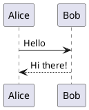

# Vomit

*[Claude Code](https://claude.com/claude-code) crushes React. This app is fully vibe-coded.*

An opinionated, keyboard-centric markdown editor for presentations and notes with **local AI support** (privacy first). Your data never leaves your machine.


## Why Vomit?

| Feature | PowerPoint | Obsidian | Marp | Vomit |
|---------|:----------:|:--------:|:----:|:-----:|
| Markdown native | ❌ | ✅ | ✅ | ✅ |
| Live preview | ✅ | ✅ | ✅ | ✅ |
| Presenter view with notes | ✅ | ❌ | ✅ | ✅ |
| Timer | ✅ | ❌ | ✅ | ✅ |
| Next slide preview | ✅ | ❌ | ✅ | ✅ |
| Standalone app | ✅ | ✅ | ❌ | ✅ |
| PlantUML diagrams | ❌ | Plugin | ✅ | ✅ |
| LaTeX math | ❌ | Plugin | ✅ | ✅ |
| Code syntax highlighting | ❌ | ✅ | ✅ | ✅ |
| **Local AI (privacy first)** | ❌ | Plugin | ❌ | ✅ |
| **RAG over your docs** | ❌ | Plugin | ❌ | ✅ |
| **Pseudonymization** | ❌ | ❌ | ❌ | ✅ |

## Platform Support

**macOS** (Intel and Apple Silicon) and **Windows**. Linux remains Electron-compatible but is not currently packaged by CI.

Keyboard shortcuts shown as **Cmd** on macOS use **Ctrl** on Windows/Linux. **Option** maps to **Alt**.

## Features

- **Markdown Editor** - Live preview, syntax highlighting (including Terraform/HCL and PowerShell in code fences like ` ```terraform `, ` ```tfvars `, ` ```powershell `, and in `.tf`/`.tfvars`/`.ps1` files), outline sidebar
- **Right Outline Bar** - Always-visible document outline on the right (Cmd+Alt+O)
- **Multi-Cursor Editing** - PyCharm-style multi-cursor: double-tap Option, then use Option+Up/Down
- **Drag & Drop** - Drag files and folders to reorganize your file tree
- **Git Awareness** - Change indicators in the editor gutter and status badges in the file tree when the folder is a git repo
- **Presenter View** - Current slide, next slide preview, speaker notes, timer
- **Local AI (Privacy First)** - Built-in AI terminal powered by Ollama - your data stays on your machine
- **RAG Search** - Index a bucket and ask AI questions with context from that bucket
- **Markdown Todos** - Track `- [ ]` tasks in notes with a bucket-wide Todo Explorer
- **Pseudonymization** - Anonymize sensitive data (names, emails, IPs) with AI, reversible with `/pseudo-depseudo`
- **LaTeX Math** - Render formulas with KaTeX (`$inline$` and `$$display$$`)
- **PlantUML & Mermaid** - Render sequence diagrams, flowcharts, and more
- **Emoji Shortcodes** - Use `:smile:` syntax like GitHub/Slack
- **File Tree** - Browse and open files in your bucket (Cmd+E)
- **Native Viewers** - Open PDF, draw.io, and image files directly inside Vomit
- **Tag & Todo Explorers** - Browse tags and open todos across the current bucket
- **Search in Files** - Search across all markdown files (Cmd+Shift+F)
- **Laser Pointer** - Press L during presentation to highlight
- **PDF Export** - Export slides to PDF for sharing
- **Image Support** - Paste images directly, resize with simple syntax
- **Themes** - Default, Dark, Catppuccin, Nord, Tokyo Night, Solarized Dark
- **Keyboard Shortcuts** - Full keyboard control for everything

## Buckets

Vomit uses "buckets" - dedicated folders to store your notes and presentations. On first launch, you'll be asked to choose a location (default: `~/Documents/Vomit`).

- **Multiple buckets** - Add as many project folders as you need via the Buckets menu
- **Quick switching** - Switch between buckets with a single click
- New markdown files are automatically created with frontmatter metadata: title, folder, created date, modified date, draft status, and tags
- Images are saved to `bucket/images/`
- No need to manually open folders - just select a bucket and write

Manage buckets from the **Buckets** menu: add new buckets, switch between them, or remove ones you no longer need.

## Todos

Todos are markdown-native. Your notes remain the source of truth; Vomit scans the current bucket and shows matching checkbox items in the Todo Explorer.

```markdown
- [ ] Send migration plan to Acme #follow-up @2026-06-01 !high
- [ ] Check Kubernetes ingress config #tech
- [x] Confirm project owner
```

- Use **Cmd+Shift+Enter** to toggle the current line or selected lines between todo states
- Use **View > Toggle Todos** or the command palette to open the Todo Explorer
- Click a todo in the explorer to open the note at that line
- Optional tokens are parsed as badges: `@YYYY-MM-DD` for due date, `!high`/`!medium`/`!low` for priority, and `#tag` for tags
- Todo Explorer reads saved markdown files in the current bucket; save or wait for auto-save after editing todos

## Installation

### Option 1: Download a Release

Download the latest macOS `.dmg` or Windows `.exe` from [Releases](https://github.com/jacqinthebox/vomit-vnext/releases).

**Important:** The app is not code-signed with an Apple Developer certificate. macOS will block it by default. After installing, run this command in Terminal to remove the quarantine flag:

```bash
xattr -cr /Applications/Vomit.app
```

Then the app will open normally.

### Option 2: Build from Source

```bash
# Clone the repository
git clone https://github.com/jacqinthebox/vomit-vnext.git
cd vomit-vnext

# Install dependencies
npm install

# Run the app
npm start

# Or build a platform package
npm run build:mac   # macOS
npm run build:win   # Windows
```

## Usage

### Slide Format

Separate slides with `---` on its own line:

```markdown
# First Slide

Your content here

---

# Second Slide

More content
```

### Speaker Notes

Add notes after `???` - only visible in presenter view:

```markdown
# Slide Title

Content for the audience

???

Notes only you can see while presenting
```

### Images

Paste images directly with Cmd+V. They are saved to an `images/` folder next to your file.

Resize images with this syntax:

```markdown
      # width 400px
      # height 300px
   # both
```

### PlantUML Diagrams

Create diagrams using PlantUML syntax in fenced code blocks:

~~~markdown

```plantuml
@startuml
Alice -> Bob: Hello
Bob --> Alice: Hi there!
@enduml
```
~~~

Diagrams are rendered via the PlantUML server. Supports sequence diagrams, class diagrams, flowcharts, and more. See [PlantUML documentation](https://plantuml.com/) for syntax.

### Emoji Shortcodes

Use GitHub/Slack-style emoji shortcodes:

```markdown
:smile: :rocket: :fire: :heart: :thumbsup: :vomit:
```

Renders as: :smile: :rocket: :fire: :heart: :thumbsup: :vomit:

Over 200 shortcodes are supported including smileys, gestures, objects, animals, food, and more.

### Ollama AI Integration (Privacy First)

Vomit includes a built-in AI terminal that talks to **two kinds of local providers**:

- **Ollama** — default, native `/api/chat`.
- **OpenAI-compatible** — any server that exposes `POST /v1/chat/completions`, including:
  - [`mlx_lm.server`](https://github.com/ml-explore/mlx-lm) (Apple Silicon, MLX)
  - vLLM, LM Studio, llama.cpp's `--api-server`, Ollama's own `/v1` shim, etc.

All AI processing happens locally — your data never leaves your machine.

**Setup (Ollama):**
1. Install Ollama from https://ollama.ai
2. Pull a model: `ollama pull qwen2.5:14b` (recommended for best results)
3. Press `Cmd+J` or select a model from the **AI** menu

**Setup (OpenAI-compatible, e.g. MLX):**
1. Start your local server, for example:
   ```bash
   pip install mlx-lm
   mlx_lm.server --model mlx-community/Qwen3-Coder-Next-4bit
   ```
2. In Vomit, open **AI → Add OpenAI-Compatible Endpoint…** and enter:
   - Name: `MLX Qwen3-Coder` (any label you like)
   - Base URL: `http://127.0.0.1:8000/v1`
   - API key: `dummy` (mlx_lm.server ignores it but the field is required)
   - Model id: `mlx-community/Qwen3-Coder-Next-4bit`
3. The provider radio in the AI menu flips to **OpenAI-Compatible** and your new endpoint becomes the active one.
4. Hit **AI → Test AI Connection** to verify the endpoint responds.
5. Press `Cmd+J` and try `/doc summarize this note`.

**Multiple endpoints:** Repeat step 2 to add more (e.g. a remote vLLM box, a second MLX model). Each endpoint shows up as a radio item in the AI menu — click one to switch. Use **Edit "…"** and **Remove "…"** to manage the active endpoint.

> RAG embeddings prefer Ollama's `nomic-embed-text` model when Ollama is
> installed. Without Ollama, they fall back to the active OpenAI-compatible
> endpoint's `/embeddings` API (e.g. LM Studio with a nomic embedding model
> downloaded) — set the model name via **AI menu → Set Embeddings Model…**
> if it differs from the default. Re-run `/reindex` after switching
> embedding backends so index and queries use the same embedder.

**Command picker:**

Type `/` in the AI terminal to open an inline command picker. Navigate with `↑`/`↓`, press `Enter` to execute (or complete to name + space if the command needs arguments), `Tab` to complete without executing, and `Escape` to close.

**Special commands:**
- `/doc <prompt>` - Include the current document in your prompt
- `/write <prompt>` - Insert AI response at cursor position
- `/write-new <prompt>` - Prompts for a document name, then **researches the web** (via the agent's Tavily search) and writes a new, web-grounded Markdown file with frontmatter — saved to disk automatically. Requires a tool-capable model and a Tavily API key (see below).
- `/write-replace <prompt>` - Replace selection with AI response
- `/summarize-folder [subfolder]` - Reads every Markdown/text file in the current folder (or an optional subfolder) and **all subfolders**, then writes a structured summary into a new `<folder>-summary.md` document
- `/format-to-md [instruction]` - Convert selected text, or the whole document, from pasted Word-style formatting to clean Markdown
- `/write-append <prompt>` - **Researches the web** and adds new, document-aware content at the end of the current doc (saving it if it's on disk). Like `/write-new`, it needs a tool-capable model and a Tavily API key.
- `/presentation <topic>` - Generate a presentation with slides and speaker notes
- `/pseudo` - Pseudonymize the current document with AI (names, emails, IPs, secrets)
- `/pseudo deterministic` - Pseudonymize the current document with the fast offline scan, no AI server required (aliases: `det`, `fast`)
- `/pseudo-text` - Pseudonymize the selected editor text (or whole document if nothing is selected) with the fast offline scan and print the result inline in the terminal to copy — nothing is written to disk
- `/pseudo-text-ai` - Same as `/pseudo-text` but uses the AI to build the mapping (needs a bucket open and the AI server running)
- `/pseudo-depseudo-text` - Reverse selected text back to the originals using the mapping built by `/pseudo-text`/`/pseudo-text-ai` this session (in-memory, cleared on restart)
- `/pseudo-deterministic [folder]` - Fast local repo/folder pseudonymization for Terraform/IaC, Azure DevOps, Python/.NET config, Kubernetes, Docker, and common secrets while preserving structural API fields and Helm template syntax
- `/pseudo-ai [folder]` - Hybrid deterministic + AI repo/folder pseudonymization for prose documents, architecture designs, HLDs, legal docs, and advisory text
- `/pseudo-run [folder]` - Alias for `/pseudo-deterministic [folder]`
- `/pseudo-map` - Show the current entity mapping
- Pseudonymization processes text-based files such as `.md`, `.markdown`, `.txt`, `.adoc`, `.rst`, YAML/JSON, IaC, config, and source files; binary documents such as `.docx`, `.pdf`, `.xlsx`, and `.pptx` are skipped.
- `/pseudo-depseudo` - Restore original data from pseudonymized file using the mapping
- `/index` - Index the current bucket for RAG search
- `/index <folder>` - Refresh only a specific folder inside the current bucket
- `/reindex` - Clear and rebuild the current bucket's RAG index
- `/rag <query>` - Search the current bucket index and ask AI with context
- `/agent <prompt>` - Agentic mode with tools (bash, file read/write/edit, project search, PDF text extraction, URL fetch, web search)
- `/chat <prompt>` - Ask the AI directly, without tools. The request skips the tool schemas, so the model starts answering much sooner — ideal for plain questions on slow local backends. Shares conversation history with agent mode, so you can mix `/chat` and `/agent` turns freely.
- `/new` - Start a new conversation (clear history)
- `/help` - Show all available commands

**Web search with Tavily:**

The `/agent`, `/write-new`, and `/write-append` commands support real-time web search via [Tavily](https://tavily.com). Set your API key once via **AI menu → Set Tavily API Key...**. When you ask the agent to search the web (e.g. `/agent search for the latest news on...`), it will automatically call the Tavily search tool and include current results in its response. `/write-new` always searches the web before writing so new documents start from current information; the research activity is shown in the terminal while only the final document is written to the editor.

The agent can also read PDF documents directly. Ask `/agent summarize ./path/to/document.pdf` and Vomit extracts the PDF text internally, without requiring `pdftotext` or another system PDF utility.

**Vision (Ollama multimodal models):** with a vision-capable model selected (llava, gemma, qwen-vl, …), the agent can see images you reference. Mention an image path in your prompt (`what's in ./shot.png?`) or use `/doc` on a document containing image links — referenced images (up to 4) are downscaled to 1024px and attached to the request automatically; you'll see `(attached 1 image: shot.png)` in the terminal. Remote URLs are not fetched. Text-only models will return an Ollama error if you attach images to them.

**Ollama context window:** Ollama serves every model with a 4096-token window by default, no matter what the model supports. Vomit requests a larger window (default 16384, capped by the model's own maximum) so long documents and images fit. Adjust via **AI menu → Set Ollama Context Size…** — larger values use more RAM. The context bar reflects the effective window.

**Agent tools:**

The agent works in a loop: the model calls tools, sees the results, and continues until the task is done. Available tools:

- `bash` — run a shell command (60s timeout, killable with the Stop button)
- `read_file` / `read_pdf` — read text files (in chunks, for large files) and PDFs
- `write_file` — create or overwrite a file
- `edit_file` — make a targeted change to an existing file by replacing an exact snippet
- `search_files` — search file contents recursively with a regex (skips `node_modules`, `.git`, binaries)
- `fetch_url` — fetch a web page and read its text content
- `tavily_search` — web search (requires a Tavily API key)

**Agent permissions:**

By default, read-only tools (file reads, searches, listings, web lookups, and read-only shell commands like `ls`, `cat`, `grep`, `git status`) run without asking. Anything that can change your system — file writes, edits, and other shell commands — shows a prompt in the terminal:

```
⚠ Allow bash? npm install
[y = yes / n = no / a = always this session]
```

Answer `y` to allow once, `n` (or Escape) to deny — the model is told and adjusts its approach — or `a` to allow that command (by its first word, e.g. all `npm …`) or tool for the rest of the session. A single keypress answers when the input line is empty. Unanswered prompts deny automatically after 2 minutes. Change the behavior via **AI menu → Agent Permissions**: *Auto-allow read-only tools* (default), *Always ask*, or *Never ask (unrestricted)*.

**Diff preview for file writes:** when the agent wants to write or edit a file, the prompt shows the exact change as a colored unified diff with a `path | +n -m` header (repo-relative when the folder is a git repo), and the keys become `[a]pprove / [r]eject / [s] = always this session`. Rejecting tells the model "User rejected this edit" so it can adapt. Toggle via **AI menu → Diff Preview for File Writes** (on by default; off falls back to the plain prompt above).

For OpenAI-compatible endpoints you can also raise the response length cap via **AI menu → Set Max Output Tokens…** (default 4096).

**RAG (Retrieval Augmented Generation):**

RAG allows the AI to answer questions using documents from the current bucket as context. First index the bucket with `/index`, then use `/rag <question>` to query that bucket with relevant context automatically retrieved.

Embeddings come from Ollama's `nomic-embed-text` when available, or otherwise
from the active OpenAI-compatible endpoint (e.g. LM Studio) — see the note in
the OpenAI-compatible section above.

```bash
# First, pull the embedding model (Ollama route)
ollama pull nomic-embed-text

# In Vomit AI terminal
/index                              # Index the current bucket
/index customers/acme               # Refresh one folder inside the bucket
/reindex                            # Clear and rebuild the current bucket index
/rag how does authentication work?  # Search the bucket and ask with context
```

The index is stored in `~/.config/vomit/rag/` to keep your bucket clean. Each bucket has its own RAG database. Use `/index <folder>` for a faster partial refresh after changing one folder, or `/reindex` after deleting, moving, or heavily reorganizing notes.

**Command history:**

The AI terminal remembers your last 100 commands across restarts. Use `↑`/`↓` (when no picker is open) to navigate history. `Cmd+K` clears both the conversation and the command history.

The AI menu shows all your installed Ollama models - just click one to switch.

## Keyboard Shortcuts

Press **Cmd+/** to view all shortcuts in the app. See [SHORTCUTS.md](SHORTCUTS.md) for the complete reference.

### Quick Reference

| Category | Shortcut | Action |
|----------|----------|--------|
| **File** | Cmd+N | New file |
| | Cmd+O | Open file |
| | Cmd+S | Save |
| **View** | Cmd+P | Toggle preview |
| | Cmd+E | Toggle file explorer |
| | Cmd+Alt+O | Toggle right outline |
| | Cmd+Shift+H | Toggle tag explorer |
| | Cmd+L | Toggle line numbers |
| | Cmd+/ | Show all shortcuts |
| **Format** | Cmd+B | Bold |
| | Cmd+I | Italic |
| | Cmd+K | Insert link |
| | Cmd+M | Code block |
| | Cmd+Shift+Enter | Toggle todo |
| **Multi-Cursor** | Option, Option, then Option+↑/↓ | Add cursor above/below |
| | Escape | Clear extra cursors |
| **Code** | Ctrl+J | Autocomplete |
| **Explorer** | ↑↓ | Navigate files |
| | ←→ | Navigate folders |
| | Drag & Drop | Move files/folders |
| **Present** | Cmd+Shift+P | Start presentation |
| | Cmd+Alt+P | With presenter view |
| | L | Laser pointer |
| **AI** | Cmd+J | Toggle AI terminal |

## Tech Stack

- Electron
- CodeMirror 5 (editor with syntax highlighting)
- Marked (markdown parsing)
- Highlight.js (code block highlighting)
- KaTeX (LaTeX math rendering)
- PlantUML (diagram rendering)
- Ollama (local AI inference)
- better-sqlite3 (RAG vector storage)

## License

MIT
