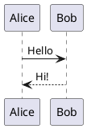

# Vomit User Manual

A keyboard-centric markdown editor for presentations and notes with local AI support.

---

## Getting Started

### Buckets

Vomit uses "buckets" - dedicated folders to store your notes and presentations. On first launch, you'll be asked to choose a location (default: `~/Documents/Vomit`).

- **Multiple buckets** - Add as many project folders as you need via the Buckets menu
- **Quick switching** - Switch between buckets from the menu
- New markdown files are automatically created with frontmatter metadata: title, folder, created date, modified date, draft status, and tags
- Images are saved to `bucket/images/`
- PDF, draw.io, and image files open directly in Vomit's preview viewer

**Managing buckets:**
- **Buckets > Add Bucket...** - Add a new folder as a bucket
- **Buckets > [bucket name]** - Switch to that bucket
- **Buckets > Remove...** - Remove the active bucket from the list (files are not deleted)

### Basic Operations

- **Cmd+N** - New file (created in current folder within bucket)
- **Cmd+O** - Open a specific file
- **Cmd+E** - Toggle file explorer
- **Cmd+Shift+Enter** - Toggle the current line or selected lines as todos

### Basic Editing

The editor uses Markdown syntax with live preview. Toggle the preview pane with **Cmd+P**.

### Todos

Todos are plain markdown checkboxes. Your markdown files are the source of truth; the Todo Explorer is a bucket-wide view over saved notes.

```markdown
- [ ] Send migration plan to Acme #follow-up @2026-06-01 !high
- [ ] Check Kubernetes ingress config #tech
- [x] Confirm project owner
```

- **Cmd+Shift+Enter** toggles the current line or selected lines as todos
- **View > Toggle Todos** opens the Todo Explorer
- Click a todo in the explorer to open the note at that line
- Optional tokens are shown as badges: `@YYYY-MM-DD`, `!high`/`!medium`/`!low`, and `#tag`
- Todo Explorer scans saved markdown files in the current bucket; save or wait for auto-save after editing todos

---

## Slide Presentations

### Creating Slides

Separate slides with `---` on its own line:

```markdown
# First Slide

Your content here

---

# Second Slide

More content
```

### Speaker Notes

Add notes after `???` - only visible in presenter view:

```markdown
# Slide Title

Content for the audience

???

Notes only you can see while presenting
```

### Presenting

- **Cmd+Shift+P** - Start presentation
- **Cmd+Alt+P** - Start with presenter view (shows notes, timer, next slide)
- **L** - Toggle laser pointer during presentation
- **Arrow keys** - Navigate slides

---

## Keyboard Shortcuts

### File Operations

| Shortcut | Action |
|----------|--------|
| Cmd+N | New file |
| Cmd+O | Open file |
| Cmd+S | Save |
| Cmd+Shift+S | Save as |
| Cmd+W | Close tab |

### View

| Shortcut | Action |
|----------|--------|
| Cmd+P | Toggle preview |
| Cmd+E | Toggle file explorer |
| Cmd+Shift+O | Toggle outline (left sidebar) |
| Cmd+Alt+O | Toggle right outline |
| Cmd+Shift+F | Search in files |
| Cmd+L | Toggle line numbers |
| Cmd+/ | Show all shortcuts |
| Cmd+. | Command palette |

### Formatting

| Shortcut | Action |
|----------|--------|
| Cmd+B | Bold |
| Cmd+I | Italic |
| Cmd+` | Inline code |
| Cmd+K | Insert link |
| Cmd+Shift+T | Format table |
| Cmd+Shift+Enter | Toggle todo line / selected lines |
| Cmd+Enter | Insert new slide |

### Tabs

| Shortcut | Action |
|----------|--------|
| Cmd+T | New tab |
| Cmd+W | Close tab |
| Cmd+Shift+] | Next tab |
| Cmd+Shift+[ | Previous tab |
| Cmd+1-8 | Go to tab 1-8 |

### AI Terminal (macOS/Linux only)

| Shortcut | Action |
|----------|--------|
| Cmd+J | Toggle AI terminal |
| Cmd+` | Toggle shell terminal |

---

## AI Features (macOS/Linux)

Vomit includes a built-in AI terminal that talks to two kinds of local providers:

- **Ollama** — the default, via `/api/chat`
- **OpenAI-compatible** — any server exposing `POST /v1/chat/completions`
  (MLX via `mlx_lm.server`, vLLM, LM Studio, llama.cpp `--api-server`, …)

All processing happens locally — your data never leaves your machine.

### Setup — Ollama

1. Install Ollama from https://ollama.ai
2. Pull a model: `ollama pull qwen2.5:14b`
3. Press **Cmd+J** or select a model from the **AI** menu

### Setup — OpenAI-compatible (example: MLX)

1. Start the server, e.g. with [`mlx_lm`](https://github.com/ml-explore/mlx-lm):
   ```bash
   pip install mlx-lm
   mlx_lm.server --model mlx-community/Qwen3-Coder-Next-4bit
   ```
2. In Vomit, **AI → Add OpenAI-Compatible Endpoint…** and enter:
   - Name: `MLX Qwen3-Coder` (any label)
   - Base URL: `http://127.0.0.1:8000/v1`
   - API key: `dummy`
   - Model id: `mlx-community/Qwen3-Coder-Next-4bit`
3. The AI menu's provider radio flips to **OpenAI-Compatible** and your endpoint becomes the active one.
4. **AI → Test AI Connection** verifies the endpoint.
5. Cmd+J then try e.g. `/doc summarize this note`.

**Multiple endpoints:** add more with **AI → Add OpenAI-Compatible Endpoint…** (one per remote/local server or per model). Each appears as a radio item in the AI menu — click to switch. **Edit "…"** and **Remove "…"** operate on the active endpoint.

> RAG embeddings still go through Ollama's `nomic-embed-text` model regardless
> of the chat provider.

### AI Commands

| Command | Description |
|---------|-------------|
| `/doc <prompt>` | Include current document in your prompt |
| `/write <prompt>` | Insert AI response at cursor position |
| `/write-new <prompt>` | Create a new file with AI response |
| `/rewrite <prompt>` | Replace selection with AI response |
| `/append <prompt>` | Add AI response at end of document |
| `/pseudo` `[--ai]` `[--customer "Name"]` | Pseudonymize the current document (fast/offline by default; `--ai` for the AI-assisted scan) |
| `/pseudo-selection` `[--ai]` | Pseudonymize selected editor text; result printed in terminal (nothing written to disk) |
| `/pseudo-repo` `[folder]` `[--all]` `[--ai]` `[--customer "Name"]` | Pseudonymize repos/folders in the bucket. No folder = auto-detect git repos; `--all` = every top-level folder; name a folder to target one |
| `/pseudo-map` | Show the current entity mapping |
| `/pseudo-restore` `[repo-name]` | Restore original data (a pseudo repo folder if named, otherwise the current document) |
| `--customer "Name"` (flag) | Force a customer/company/person name into the mapping so it is always replaced, even in the deterministic scan. Repeatable; alias `--name`; case-insensitive with word boundaries. Use `--customer "Name=Replacement"` to choose the replacement (e.g. `Lidl=GroceryShop`). Works with `/pseudo` and `/pseudo-repo`. Example: `/pseudo-repo my-repo --customer "Lidl=GroceryShop"` |
| Supported pseudo files | Text-based files such as `.md`, `.markdown`, `.txt`, `.adoc`, `.rst`, YAML/JSON, IaC, config, and source files; binary documents such as `.docx`, `.pdf`, `.xlsx`, and `.pptx` are skipped |
| Legacy aliases | `/pseudo-deterministic`, `/pseudo-ai`, `/pseudo-run`, `/pseudo-text`, `/pseudo-text-ai`, `/pseudo-depseudo`, `/pseudo-depseudo-text` still work but are hidden from the picker |
| `/index` | Index the current bucket for RAG search |
| `/index <folder>` | Refresh a specific folder inside the current bucket index |
| `/reindex` | Clear and rebuild the current bucket's RAG index |
| `/rag <query>` | Search the current bucket index and ask AI with context |
| `/presentation <topic>` | Generate a presentation with slides and speaker notes |
| `/agent <prompt>` | Agentic mode with tools (bash, file read/write, web search) |
| `/new` | Start a new conversation and clear AI history |
| `/help` | Show all available terminal commands |

### RAG (Retrieval Augmented Generation)

RAG lets the AI answer questions using documents from the current bucket as context:

```bash
# First, pull the embedding model
ollama pull nomic-embed-text

# In Vomit AI terminal
/index                              # Index the current bucket
/index customers/acme               # Refresh one folder in the bucket
/reindex                            # Clear and rebuild the current bucket index
/rag how does authentication work?  # Search the bucket and ask
```

**How it works:**

1. `/index` chunks your bucket documents and creates embeddings using `nomic-embed-text`
2. Embeddings are stored in a SQLite database at `~/.config/vomit/rag/`
3. Each bucket has its own database - the index persists across sessions
4. `/rag <query>` finds similar chunks and includes them as context for the AI

**Supported file types:** `.md`, `.txt`, `.js`, `.ts`, `.py`, `.json`, `.yaml`, `.yml`, `.xml`, `.html`, `.css`, `.tf`, `.sh`, `.tpl`

### Agent Mode

Use `/agent` for agentic AI with tool calling - the AI can run commands, read/write files:

```bash
/agent list the files in this directory
/agent run kubectl get pods
/agent create a hello world script in hello.py
/new                                # Clear conversation history
```

**Available tools:**
- `bash` - Run any shell command
- `read_file` - Read file contents
- `write_file` - Create or overwrite files
- `list_files` - List directory contents

Agent mode has **conversation memory** - follow-up questions work:

```bash
/agent run kubectl get pods
/agent what does that output mean?  # Remembers previous result
```

---

## Markdown Features

### Images

Paste images directly with **Cmd+V**. They are saved to an `images/` folder.

Resize images with this syntax:

```markdown
      # width 400px
      # height 300px
   # both
```

### LaTeX Math

Use KaTeX syntax for math formulas:

- Inline: `$E = mc^2$`
- Display: `$$\int_0^\infty e^{-x^2} dx$$`

### PlantUML Diagrams

Create diagrams in fenced code blocks:

~~~markdown

~~~

### Emoji Shortcodes

Use GitHub/Slack-style shortcodes:

```markdown
:smile: :rocket: :fire: :heart: :thumbsup:
```

### Code Blocks

Syntax highlighting for many languages:

~~~markdown
```python
def hello():
    print("Hello, World!")
```
~~~

---

## Themes

Change themes from the **View** menu:

- Default (Light)
- Dark
- Catppuccin
- Nord
- Tokyo Night
- Solarized Dark

---

## Multi-Cursor Editing

Vomit supports PyCharm-style multi-cursor editing. Double-tap **Option**, then press **Option+Up** or **Option+Down**. Empty lines are skipped when adding cursors.

| Shortcut | Action |
|----------|--------|
| Option, Option, then Option+↑ | Add cursor above |
| Option, Option, then Option+↓ | Add cursor below |
| Escape | Clear all extra cursors |

This allows you to edit multiple lines simultaneously - great for renaming variables or adding/removing text on multiple lines at once.

---

## File Tree

### Drag & Drop

You can drag files and folders in the file tree to reorganize them:

- Drag any file or folder onto a folder to move it there
- The target folder highlights when you hover over it
- Cannot drop a folder into itself or its children

### Keyboard Navigation

| Shortcut | Action |
|----------|--------|
| ↑ / ↓ | Navigate between files |
| → | Expand folder / Enter |
| ← | Collapse folder / Go to parent |
| Enter | Open file or toggle folder |
| Escape | Return focus to editor |

---

## Tips

- Use **Cmd+.** to open the command palette for quick access to all commands
- The outline sidebar (**Cmd+Shift+O**) shows document headings for navigation
- The right outline (**Cmd+Alt+O**) provides an always-visible document structure
- Auto-save is enabled by default - your work is saved automatically
- Use **Ctrl+J** in the editor for autocomplete suggestions
- Drag and drop files/folders in the file tree to reorganize
