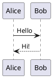

# Vomit User Manual

A keyboard-centric markdown editor for presentations and notes with local AI support.

---

## Getting Started

### Opening Files and Folders

- **Cmd+O** - Open a file
- **Cmd+Alt+O** - Open a folder
- **Cmd+N** - New file

When you open a folder, the file explorer appears on the left (toggle with **Cmd+E**).

### Basic Editing

The editor uses Markdown syntax with live preview. Toggle the preview pane with **Cmd+P**.

---

## Slide Presentations

### Creating Slides

Separate slides with `---` on its own line:

```markdown
# First Slide

Your content here

---

# Second Slide

More content
```

### Speaker Notes

Add notes after `???` - only visible in presenter view:

```markdown
# Slide Title

Content for the audience

???

Notes only you can see while presenting
```

### Presenting

- **Cmd+Shift+P** - Start presentation
- **Cmd+Alt+P** - Start with presenter view (shows notes, timer, next slide)
- **L** - Toggle laser pointer during presentation
- **Arrow keys** - Navigate slides

---

## Keyboard Shortcuts

### File Operations

| Shortcut | Action |
|----------|--------|
| Cmd+N | New file |
| Cmd+O | Open file |
| Cmd+Alt+O | Open folder |
| Cmd+S | Save |
| Cmd+Shift+S | Save as |
| Cmd+W | Close tab |

### View

| Shortcut | Action |
|----------|--------|
| Cmd+P | Toggle preview |
| Cmd+E | Toggle file explorer |
| Cmd+Shift+O | Toggle outline |
| Cmd+Shift+F | Search in files |
| Cmd+L | Toggle line numbers |
| Cmd+/ | Show all shortcuts |
| Cmd+. | Command palette |

### Formatting

| Shortcut | Action |
|----------|--------|
| Cmd+B | Bold |
| Cmd+I | Italic |
| Cmd+` | Inline code |
| Cmd+K | Insert link |
| Cmd+T | Insert table |

### Tabs

| Shortcut | Action |
|----------|--------|
| Cmd+T | New tab |
| Cmd+W | Close tab |
| Cmd+Shift+] | Next tab |
| Cmd+Shift+[ | Previous tab |
| Cmd+1-8 | Go to tab 1-8 |

### AI Terminal (macOS/Linux only)

| Shortcut | Action |
|----------|--------|
| Cmd+J | Toggle AI terminal |
| Cmd+` | Toggle shell terminal |

---

## AI Features (macOS/Linux)

Vomit includes a built-in AI terminal powered by Ollama. All processing happens locally - your data never leaves your machine.

### Setup

1. Install Ollama from https://ollama.ai
2. Pull a model: `ollama pull qwen2.5:14b`
3. Open a folder in Vomit (Cmd+Alt+O)
4. Press **Cmd+J** or select a model from the AI menu

### AI Commands

| Command | Description |
|---------|-------------|
| `/doc <prompt>` | Include current document in your prompt |
| `/pseudo` | Pseudonymize current document (names, emails, IPs) |
| `/depseudo` | Restore original data from pseudonymized file |
| `/index` | Index all documents for RAG search |
| `/index subfolder` | Index only a specific subfolder |
| `/index file.xml` | Index a single file |
| `/rag <query>` | Search indexed documents and ask AI with context |
| `/agent <prompt>` | Agentic mode with tools (bash, file read/write) |
| `/agent clear` | Clear agent conversation history |

### RAG (Retrieval Augmented Generation)

RAG lets the AI answer questions using your project documents as context:

```bash
# First, pull the embedding model
ollama pull nomic-embed-text

# In Vomit AI terminal
/index                              # Index entire project
/index subfolder                    # Index specific subfolder
/index file.xml                     # Index a single file
/rag how does authentication work?  # Search and ask
```

**How it works:**

1. `/index` chunks your documents and creates embeddings using `nomic-embed-text`
2. Embeddings are stored in a SQLite database at `~/.config/vomit/rag/`
3. The database is **tied to the open folder** - each project has its own index
4. `/rag <query>` finds similar chunks and includes them as context for the AI

**Supported file types:** `.md`, `.txt`, `.js`, `.ts`, `.py`, `.json`, `.yaml`, `.yml`, `.xml`, `.html`, `.css`, `.tf`, `.sh`, `.tpl`

**Note:** You must have a folder open (`Cmd+Alt+O`) for RAG to work. The index persists - close and reopen the folder and your index is still there.

### Agent Mode

Use `/agent` for agentic AI with tool calling - the AI can run commands, read/write files:

```bash
/agent list the files in this directory
/agent run kubectl get pods
/agent create a hello world script in hello.py
/agent clear                        # Clear conversation history
```

**Available tools:**
- `bash` - Run any shell command
- `read_file` - Read file contents
- `write_file` - Create or overwrite files
- `list_files` - List directory contents

Agent mode has **conversation memory** - follow-up questions work:

```bash
/agent run kubectl get pods
/agent what does that output mean?  # Remembers previous result
```

---

## Markdown Features

### Images

Paste images directly with **Cmd+V**. They are saved to an `images/` folder.

Resize images with this syntax:

```markdown
      # width 400px
      # height 300px
   # both
```

### LaTeX Math

Use KaTeX syntax for math formulas:

- Inline: `$E = mc^2$`
- Display: `$$\int_0^\infty e^{-x^2} dx$$`

### PlantUML Diagrams

Create diagrams in fenced code blocks:

~~~markdown

~~~

### Emoji Shortcodes

Use GitHub/Slack-style shortcodes:

```markdown
:smile: :rocket: :fire: :heart: :thumbsup:
```

### Code Blocks

Syntax highlighting for many languages:

~~~markdown
```python
def hello():
    print("Hello, World!")
```
~~~

---

## Themes

Change themes from the **View** menu:

- Default (Light)
- Dark
- Catppuccin
- Nord
- Tokyo Night
- Solarized Dark

---

## Tips

- Use **Cmd+.** to open the command palette for quick access to all commands
- The outline sidebar (**Cmd+Shift+O**) shows document headings for navigation
- Auto-save is enabled by default - your work is saved automatically
- Use **Ctrl+J** in the editor for autocomplete suggestions
