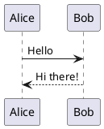

# Welcome to Vomit vNext

A markdown presentation tool

???
This is the first slide. Welcome everyone to the presentation!

---

## Features

- **Live markdown preview**
- Presenter view with notes
- Next slide preview
- Multiple themes
- Timer for presentations

???
These are the key features we'll demonstrate today.

---

## Slide Separators

Use `---` on its own line to separate slides

Use `???` to start speaker notes

```markdown
# Slide Title

Content here

???
Speaker notes here
```

???
Explain how the slide format works. The triple dash creates a new slide.

---

## Images

Paste images directly with **Cmd+V**

Resize with syntax:
```markdown
     - width only
     - height only
  - both
```

???
Images are saved to an images/ folder next to your markdown file.

---

## Image Demo

 Small (64px)

 Medium (128px)

 Large (200px)

???
This demonstrates the image resize syntax in action.

---

## Code Highlighting

```javascript
function greet(name) {
  console.log(`Hello, ${name}!`);
}

greet('World');
```

???
Code blocks are syntax highlighted automatically.

---

## Themes Available

- Default (light)
- Dark
- Catppuccin
- Nord
- Solarized Dark

Change themes from the **Theme** menu

???
You can switch themes any time during editing or presentation.

---

## Keyboard Shortcuts

| Key | Action |
|-----|--------|
| Right / Space | Next slide |
| Left | Previous slide |
| Home | First slide |
| End | Last slide |
| R | Reset timer |

???
The presenter view shows these shortcuts too.

---

# LaTeX

$$|\psi\rangle = \frac{1}{\sqrt{2^n}} \sum_{x=0}^{2^n - 1} |x\rangle$$

???
Support for LaTex  
`$$|\psi\rangle = \frac{1}{\sqrt{2^n}} \sum_{x=0}^{2^n - 1} |x\rangle$$`

---

# Plant UML




---

## Emoji Shortcodes :tada:

Use shortcodes like GitHub/Slack:

- `:smile:` :smile:
- `:rocket:` :rocket:
- `:fire:` :fire:
- `:heart:` :heart:
- `:thumbsup:` :thumbsup:
- `:vomit:` :vomit:

???
Over 200 emoji shortcodes are supported!

---

# Check the down menus for more commands

> and see the keyboard shortcuts

---

# Thank You!

Questions?

Check out [the GitHub repo](https://github.com/jacqinthebox/vomit-vnext) for more info.

???
End of presentation. Open the floor for questions.


